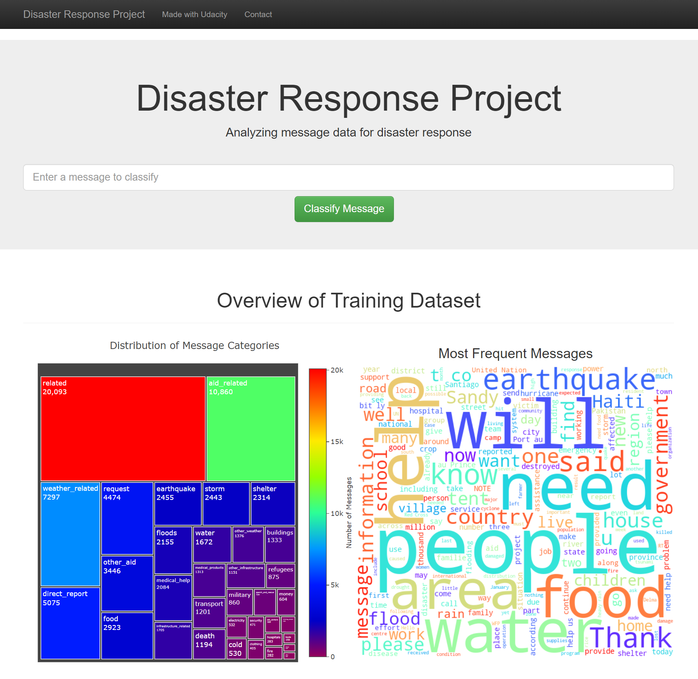

# Disaster Response Pipeline

#### Welcome to the Udacity Data Scientist Nanodegree capstone project II - a Disaster Response Pipeline. 
- This excercise is meant as a practice of writing machine learning pipelines - with focus on ETL, model training and deployment in a web-app. 
- The main idea behind this project is to create a pipeline able to automatically identify disasters based on text messages around the social media using a machine learning classifier. 
- This project uses dataset shared Apen/Figure 8 company, containing real world messages sent during disasters. 

-----------

#### The Solution. 
- The core mechanism of this solution is NLP-based feature extraction using NLTK, serving as training data for a multioutput XGBoost classifier. 
- This classifier is trained to classify 36 different targets, being various types of disasters. 
- The predictions are linked to a flask-based web-app where user can see a visual output, along with graph representation of training dataset. 

-----------

#### How to run the project. 
Data needed : disasters_messages dataframe, disasters_categories dataframe  
**To run the ETL script, use command :** 
  python process_data.py ./data/disaster_messages.csv ./data/disaster_categories.csv ./data/disaster_database     
**To run the ML Training script, use command :** 
  python train_classifier.py ./data/disaster_database.db ./models/classifier.pkl    
**To launch the web-app :**  simply run the app.py script. 

-----------

###### Index screen view - visualization of training dataaset composition. 

