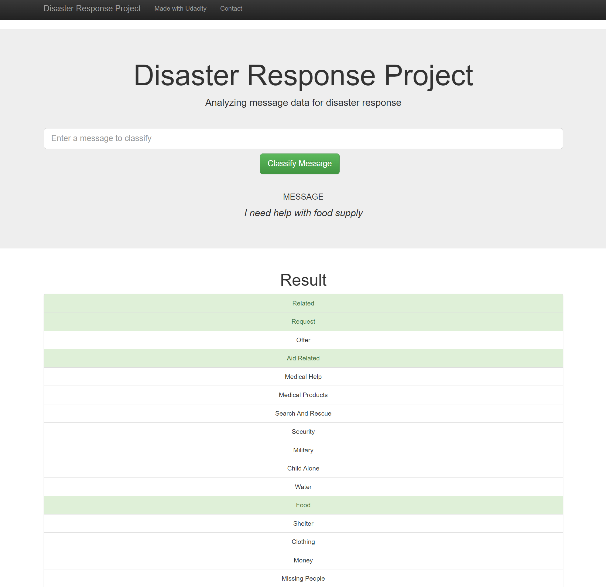

# Disaster Response Pipeline

#### Welcome to the Udacity Data Scientist Nanodegree capstone project II - a Disaster Response Pipeline.<br>
- This excercise is meant as a practice of writing ML pipelines - with focus on ETL, model training and deployment using a web-app.<br>
- The goal is to create a pipeline for classifying disaster-related messages using a machine learning classifier.<br>
- This project uses dataset shared Apen/Figure 8 company, containing real world messages sent during disasters.<br>

-----------

#### Project Summary<br>

Following a disaster, there is typically a significant spike in communication across social media and direct messages.<br>
This surge occurs at a time when disaster response organizations often have the least capacity to filter and analyze the vast volume of messages.
As a result, important information can easily get lost in the overwhelming amount of communication.<br>

This project addresses that issue. A supervised classifier, trained on disaster-related messages and labeled by type of disaster or problem, can quickly filter out the relevant information.
This enables the appropriate disaster response teams to receive crucial messages — whether they are related to water supply, medical aid, or other critical areas.
By ensuring that key messages reach the right professionals swiftly, the model helps make disaster response more efficient, ultimately improving the lives of those affected.

-----------

#### The Solution<br>
- The solution is based on NLP-driven feature extraction using NLTK, serving as training data for a multioutput XGBoost classifier.<br>
- This classifier is trained to classify 36 different targets, being various types of disasters.<br>
- The predictions are linked to a flask-based web-app where user can see a visual output, along with graph representation of training dataset.<br>

-----------

#### Files in the Repository<br>

```
/project-root
│
├── train_classifier.py
├── process_data.py
├── README.md
│
├── models
│   └── classifier.pkl
│
├── data
│   ├── disaster_categories.csv
│   ├── disaster_database.db
│   └── disaster_messages.csv
│
└── app
    ├── run.py
    │
    ├── templates
    │   ├── go.html
    │   └── master.html
    │
    └── static
        └── wordcloud.png
```

-----------
#### How to run the project<br>
Data needed : disasters_messages dataframe, disasters_categories dataframe <br>
**To run the ETL script, use command :**<br>
>python process_data.py ./data/disaster_messages.csv ./data/disaster_categories.csv ./data/disaster_database    <br>

**To run the ML Training script, use command :**<br>
>python train_classifier.py ./data/disaster_database.db ./models/classifier.pkl   <br>

**To launch the web-app :**<br>
>simply run the app.py script.<br>

-----------

###### Index screen view - visualization of training dataaset composition.<br>


###### Result screen view - classification of the inputed message.<br>

